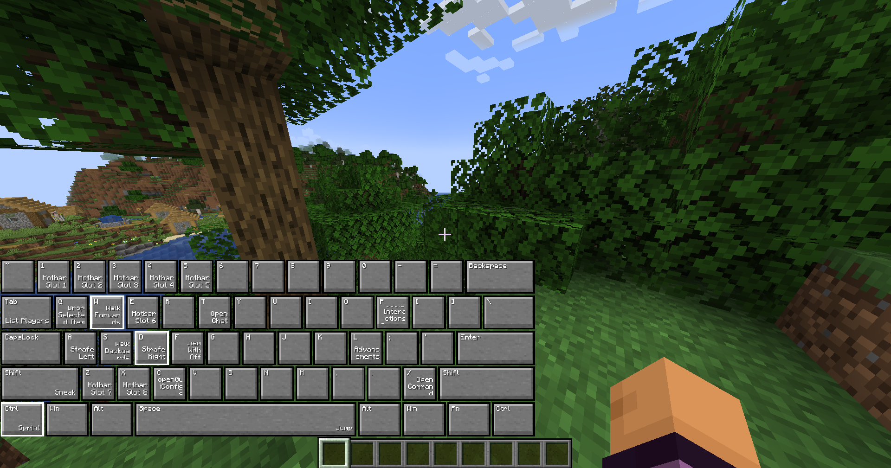

# VisualKeys
A utility fabric mod. Adds screen keyboard with display of all Vanilla & MaliLib keybindings

The keyboard can be displayed in control options or right in the game HUD. The HUD keyboard can be configured and disabled.

